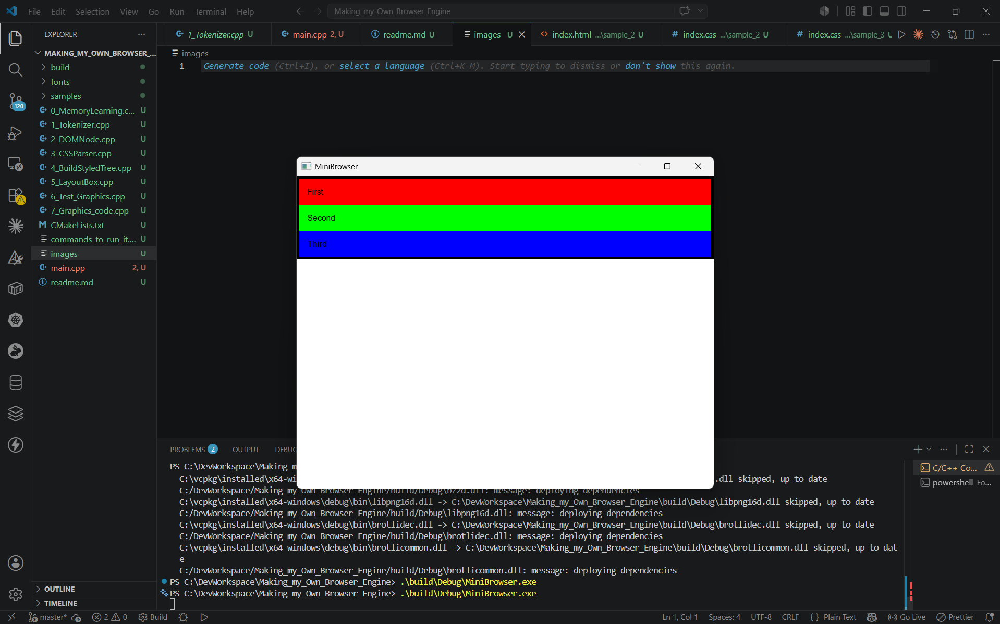

# MiniBrowser

A browser rendering engine built from scratch in C++ — no Chromium, no WebKit, no existing parsing or layout libraries. Just raw HTML/CSS text in, real pixels out, through a pipeline I designed and implemented myself: tokenizing, DOM construction, CSS parsing, the cascade, layout, and painting.

This is a college CS project, built to genuinely understand how browsers work under the hood rather than to compete with Chrome.



## What it actually does

Give it an HTML file and a CSS file, and it will:

- Parse the HTML into a DOM tree (nested elements, text nodes, attributes)
- Parse the CSS into a list of rules (tag, class, and ID selectors)
- Match CSS rules to DOM nodes and resolve conflicts using a simplified specificity model (ID > Class > Tag)
- Apply inheritance for properties like `color` and `font-size`
- Compute block-level layout — the full box model (content, padding, border, margin), with elements stacking vertically
- Paint the result to a real window using SFML

All of this runs through a from-scratch pipeline:

```
HTML text → Tokenizer → DOM Tree → CSS Parser → Style/Cascade → Layout Tree → Painter → Pixels
```

## Demo

| Sample | What it proves |
|---|---|
| `samples/sample_1` | End-to-end pipeline sanity check (nested div/p, class + id selectors, padding) |
| `samples/sample_2` | Box model correctness across 3 levels of nesting |
| `samples/sample_3` | Sibling elements correctly stack vertically (layout cursor advancement) |

## Why build this from scratch instead of using a real engine

Anyone can wrap Chromium (CEF) or WebKit and call it a "browser" — that's how Brave, Arc, and most "new browsers" you've heard of actually work. This project deliberately does the opposite: it implements the rendering pipeline itself, on a reduced but real subset of HTML/CSS, to demonstrate an actual working understanding of parsing, tree structures, the CSS cascade, and layout algorithms — not to build a production browser.

## What's intentionally out of scope

A real browser engine is millions of lines of code built over decades. This project is scoped deliberately, not incompletely:

- **No JavaScript execution** — implementing `<script>` would mean building a second programming language interpreter (tokenizer, parser, and execution engine) inside this one
- **No real networking** — local files only; HTTP/TLS/DNS solve a different problem than rendering
- **No modern CSS layout** (flexbox, grid) — block layout only, which keeps the layout algorithm tractable while still requiring real recursive box-model math
- **No full HTML5 error-recovery spec** — malformed input is handled gracefully (no crashes), but not per-spec
- **No image support** — text and colored boxes only

Each of these is a separate, large engineering problem in its own right — excluding them is what made it possible to build everything else correctly in the available time.

## Architecture

The pipeline is implemented in a single `main.cpp`, organized top-to-bottom in the same order data flows through the system:

1. **Tokenizer** — converts raw HTML text into a flat token stream (open/close/self-closing tags, text, attributes)
2. **DOM tree builder** — consumes the token stream with a stack-based algorithm to build a proper nested tree
3. **CSS parser** — converts raw CSS text into a list of rules (selector + declarations)
4. **Style/cascade engine** — matches CSS rules to DOM nodes, resolves conflicts via specificity, applies inheritance, producing a styled tree
5. **Layout engine** — walks the styled tree recursively, computing the box model (x, y, width, height, content/padding offsets) for every node
6. **Painter** — walks the layout tree and draws it with SFML

The repo also includes numbered files (`1_Tokenizer.cpp`, `2_DOMNode.cpp`, `3_CSSParser.cpp`, etc.) — these are the incremental, independently-tested checkpoints built and verified while developing each pipeline stage, kept as a record of the build process rather than folded into the final program.

Every stage has a print/debug function (e.g. `printTokens`, `printDOMTree`, `printStyledDOM`, `printLayoutTree`) used to verify its output independently before being wired into the next stage — this was the actual development process: build a stage, verify it in isolation, then connect it.

## Building and running

**Dependencies:**
- [Visual Studio 2022 Community](https://visualstudio.microsoft.com/) (provides the C++ compiler)
- [CMake](https://cmake.org/download/) (make sure it's added to your PATH)
- [vcpkg](https://github.com/microsoft/vcpkg), with [SFML 3](https://www.sfml-dev.org/) installed through it (`vcpkg install sfml`)

**Build (Windows, PowerShell):**

```powershell
& "C:\Program Files\CMake\bin\cmake.exe" -B build -DCMAKE_TOOLCHAIN_FILE=C:/vcpkg/scripts/buildsystems/vcpkg.cmake
& "C:\Program Files\CMake\bin\cmake.exe" --build build
.\build\Debug\MiniBrowser.exe
```

Adjust the `cmake.exe` path and the vcpkg toolchain file path if your installations live somewhere other than the locations above.

Which sample renders is currently set by a hardcoded path in `main.cpp` (`readFile("samples/sample_1/index.html")`) — to view a different sample, change this string to point at `sample_2` or `sample_3` and rebuild. Making this a command-line argument instead of a recompile is on the to-do list (see "What I'd build next" below).

## Known limitations

- Text is always rendered in black — `color` is correctly parsed, cascaded, and inherited through the style tree, but the painter doesn't yet apply it visually
- Text does not wrap onto multiple lines — long text will overflow its box
- Pixel values must be whole numbers (no decimals, no negative margins)
- One CSS file per page; no `<style>` tag extraction from HTML

These are documented, deliberate stopping points given the project's scope and timeline — not bugs.

## What I'd build next

Real text measurement and line-wrapping (using SFML's font metrics), text color rendering, command-line arguments to select which sample to load instead of editing and recompiling, and possibly a minimal flexbox-like row layout.